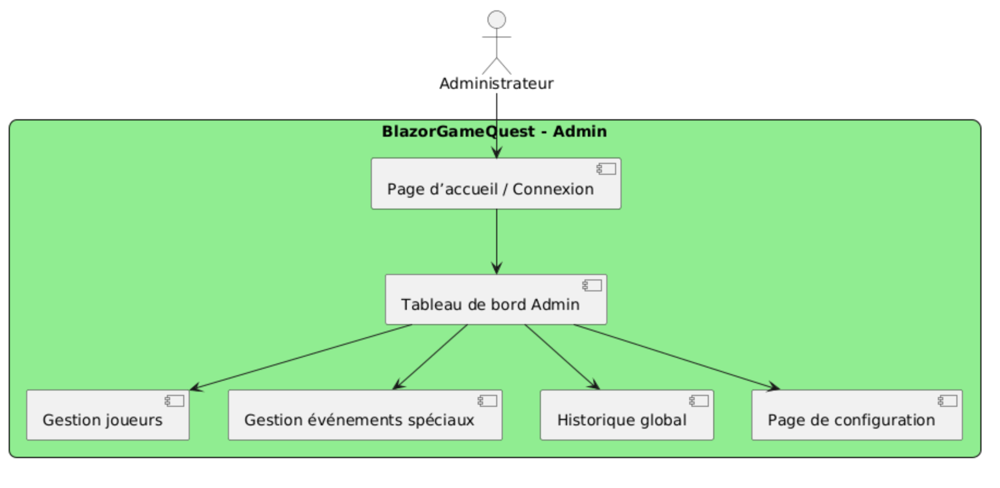
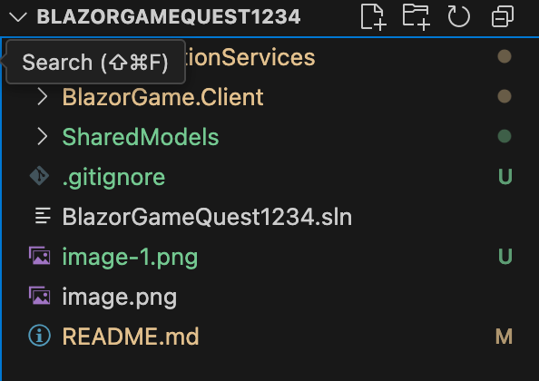
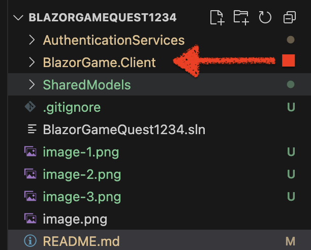
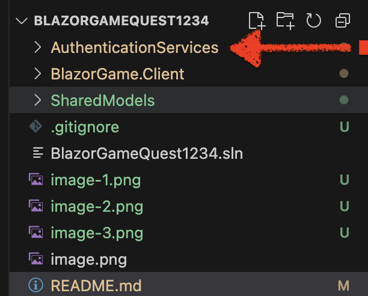

# Version 1 - Cahier des charges

## Identification de l’ensemble des pages pour le projet.

- Pages Client

    * Page d’accueil / Connexion
    * Tableau de bord joueur
    * Interface de jeu
    * Fin de partie
    * Classement / Historique personnel

- Pages Administrateur

    * Tableau de bord Admin
    * Historique global

- Pages d’erreur

    * Erreur 404
    * Gestion erreur authentification (Keycloak)
    * Page de configuration

## Diagamme de cas d'utilisation

### Joueur

### Admin (dev)

# Comment démarrer le projet

## 1. Cloner le dépôt
git clone https://github.com/ton-compte/BlazorGameQuest1234.git
cd BlazorGameQuest1234

## 2. Restaurer les dépendances
dotnet restore

## 3. Compiler la solution
dotnet build

## 4. Lancer les projets

### Lancer le client Blazor

cd BlazorGame.Client
dotnet run
### Accessible sur : http://localhost:5000

### Lancer le service d’authentification

cd AuthenticationServices
dotnet run
### Accessible sur : http://localhost:5001/api/auth

## 5. Urls d'utilisation
- Joueur : http://localhost:5000
- Admin : http://localhost:5000/admin

