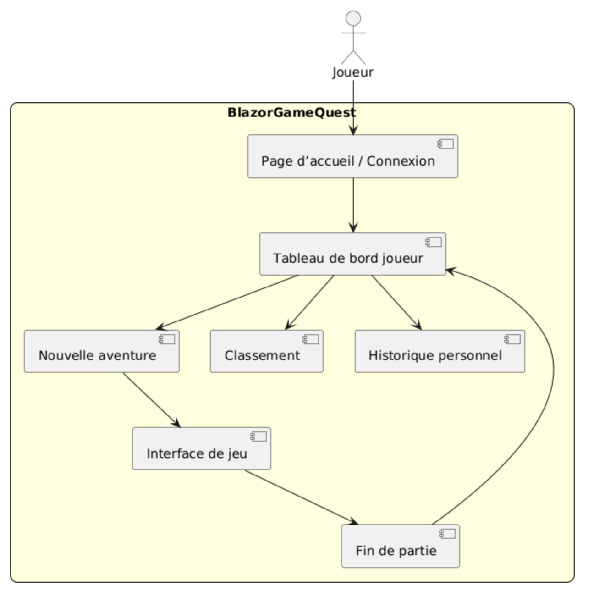

# DERNIÈRE ANALYSE SONAR 

# NOM DES MEMEBRES DU BINOME
Godwin KANLINSOU

Sarusman SATKUNARAJAH SARUSMAN

# Version 1 - Cahier des charges

## Démmarrage VERSION 1
`cd BlazorGame.Client`

`dotnet build & dotnet run`

# Structure du projet & Justification

## AuthenticationServices

Ce service gère l’authentification et la configuration avec Keycloak
Il permet la connexion, la gestion des rôles (Admin / Joueur).

## BlazorGame.Client

Projet Blazor WebAssembly (le front-end du jeu).
Il contient l’interface utilisateur, la page d’accueil, la navigation, et l’affichage des choix pendant l’aventure.

## BlazorGame.GameServices

Service Web API qui gère la partie “jeu” côté serveur.
Il expose les endpoints pour les salles, les événements, et la progression des joueurs pendant une partie.

## SharedModels

Bibliothèque partagée entre tous les projets.
Elle contient les modèles, les DTOs, les énumérations et les objets utilisés.

## BlazorGame.Tests

Tous les tests qu'on veut faire dans le projet sont dans le fichier

BlazorGame.Tests/UnitTest.cs

lien Github:
https://github.com/sarusman/BlazorGameQuest1234/blob/Prod/BlazorGame.Tests/UnitTest1.cs

## Identification de l’ensemble des pages pour le projet.

- Pages Client

    * Page d’accueil / Connexion
    * Tableau de bord joueur
    * Interface de jeu
    * Fin de partie
    * Classement / Historique personnel

- Pages Administrateur

    * Tableau de bord Admin
    * Historique global

- Pages d’erreur

    * Erreur 404
    * Gestion erreur authentification (Keycloak)
    * Page de configuration

## Mise en place d’une Intégration Continue (CI)

À chaque push, le pipeline exécute automatiquement :

https://github.com/sarusman/BlazorGameQuest1234/actions
* Build du projet

* Exécution des tests unitaires

* Analyse de la qualité du code via SonarCloud (maintenabilité, duplication, complexité, couverture de tests).

## Diagamme de cas d'utilisation

### Joueur

### Admin (dev)

# Comment démarrer le projet

## 1. Cloner le dépôt
git clone https://github.com/ton-compte/BlazorGameQuest1234.git
cd BlazorGameQuest1234

## 2. Restaurer les dépendances
dotnet restore

## 3. Compiler la solution
dotnet build

## 4. Lancer les projets

## 5. Installer xUnit
dotnet new install xunit.v3.templates
cd BlazorGame.Tests/
dotnet build
dotnet test

### Lancer le client Blazor

cd BlazorGame.Client
dotnet run
### Accessible sur : http://localhost:5000

### Lancer le service d’authentification

cd AuthenticationServices
dotnet run
### Accessible sur : http://localhost:5001/api/auth

## 5. Urls d'utilisation
- Joueur : http://localhost:5000
- Admin : http://localhost:5000/admin
